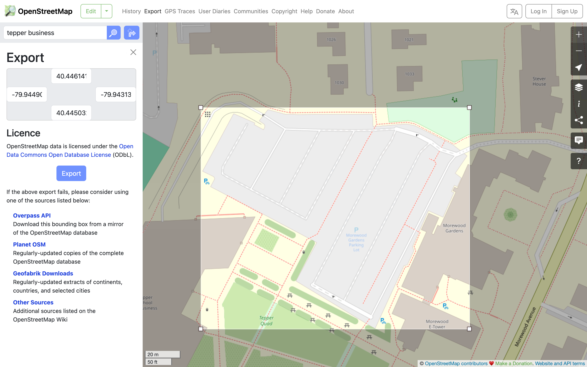
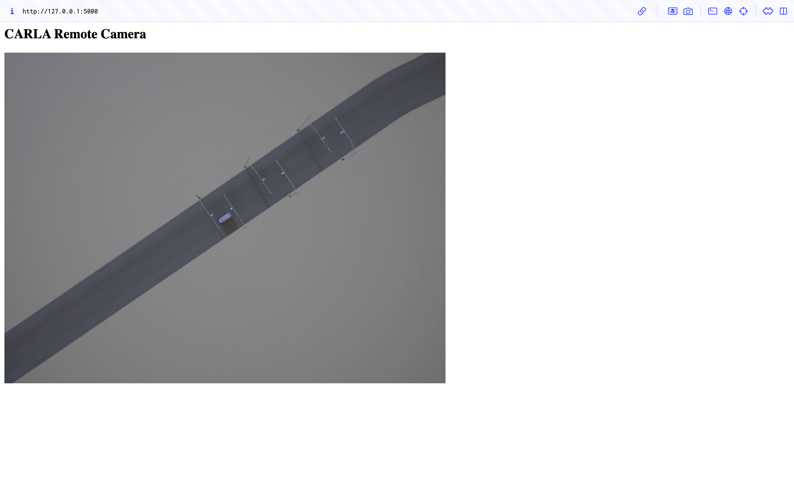

# Run Carla on Remote Server and Display on local machine
For Mac user, we cannot install CARLA locally, so the best way of doing so is to install on ECE machine and then display it locally on Mac. Workflow as follow:

Architecture:
```
REMOTE SERVER
---------------------------------
CarlaUE4.sh (simulator)
web_view.py (camera streaming)

        │
        │ HTTP video stream
        │
        ▼
SSH tunnel
localhost:5000 → remote:5000

        │
        ▼

YOUR MAC
---------------------------------
Browser displaying live simulation
```

## Installation
Since CMU provides Andrew File System ( AFS ) storage space for all students and each student at CMU is provided 2gb of space, it won't be enough for CARLA installation. So we will install CARLA in `/scratch` folder, where files here that are more than 28 days old are automatically deleted. This would be enough if we keep using it this semester.

### Terminal 1
```shell
# ssh to ece server
ssh jiaweis2@ece000.ece.local.cmu.edu

# make dir in scratch folder for CARLA installation
mkdir /scratch/jiaweis2
cd /scratch/jiaweis2

# install CARLA 9.15
wget -O CARLA_0.9.15.tar.gz https://tiny.carla.org/carla-0-9-15-linux

# extract CARLA
tar -xzf CARLA_0.9.15.tar.gz
```

Now we should see structure as follow:
```
/scratch/jiaweis2
    CarlaUE4
    CarlaUE4.sh
    PythonAPI
    Engine
    Plugins
    ...
```

Next, we need to install Python API. Since CARLA 0.9.15 shipped us a Python 3.7 wheel, but this server only has Python 3.6.8, we need a Python 3.7 environment on the remote server. Also, since conda is not available on the server, we need to download miniconda first.

```shell
# doanload miniconda in home dir
cd ~
wget https://repo.anaconda.com/miniconda/Miniconda3-py39_25.1.1-2-Linux-x86_64.sh
bash Miniconda3-py39_25.1.1-2-Linux-x86_64.sh
# press Enter to read, type yes
# when asking about installation path, enter: /scratch/jiaweis2/miniconda3

# then close ssh terminal or run
source /scratch/jiaweis2/miniconda3/etc/profile.d/conda.sh
```

Then, we can create python 3.7 environment and install CARLA wheel
```shell
# create env
conda create -n carla37 python=3.7 -y
conda activate carla37

# install wheel
cd /scratch/jiaweis2/PythonAPI/carla/dist
python -m pip install carla-0.9.15-cp37-cp37m-manylinux_2_27_x86_64.whl

# verify installation
python -c "import carla; print(carla.__file__)"
# if this prints a path, the client is installed correctly.

# install dependencies
cd /scratch/jiaweis2/PythonAPI/examples
python -m pip install -r requirements.txt
```

We are all set with CARLA installation.


## Get it runnning
We need 3 terminals to get it running and displayed.

### Terminal 1:
First, we start CARLA running without rendering window. 
```shell
ssh jiaweis2@ece000.ece.local.cmu.edu
cd /scratch/jiaweis2
./CarlaUE4.sh -RenderOffScreen
```


### Terminal 2:
Now, we can run python script we designed for camera view defined by ourselves.
```shell
ssh jiaweis2@ece000.ece.local.cmu.edu
source /scratch/jiaweis2/miniconda3/etc/profile.d/conda.sh
conda activate carla37
python /scratch/jiaweis2/scripts/web_view.py

# if encounter problem: No module named 'cv2', run the following
python -m pip install flask opencv-python-headless numpy
```

### Terminal 3:
We create an SSH tunnel from your Mac to the remote CARLA server. This means 
- our Mac localhost:2000
- forwards to server localhost:2000
So our Mac can talk to CARLA as if it were local.
```shell
ssh -L 5000:127.0.0.1:5000 jiaweis2@ece000.ece.local.cmu.edu
```

### On local machine, open:
```
http://127.0.0.1:5000/
```
This allows us to see the CARLA camera stream in our browser.

Now we have:
- Remote Terminal 1: CARLA simulator server
- Remote Terminal 2: Python camera streamer
- Mac Terminal: SSH tunnel
- Mac browser: live simulation view


### Possible Connection Rejection
If the connection get rejected by 
```
Address already in use
Port 5000 is in use by another program. Either identify and stop that program, or start the server with a different port
```
We need to kill current CARLA process then relauntch it:
```shell
# listen to port 2000 for dead CARLA process
ss -ltnp | grep 2000

# force kill
kill -9 <id of that CARLA process>
```

# Loading a map
## OSM
We will load a OSM map to CARLA. The map is up to your choice. Visit [CARLA OSM instruction](https://carla.readthedocs.io/en/latest/tuto_G_openstreetmap/#generate-maps-with-openstreetmap) page for map cropping instructions.

Next, we transfer the map to remote server.
### Local terminal:
```shell
scp map_1.osm jiaweis2@ece000.ece.local.cmu.edu:/scratch/jiaweis2/maps/
```

### Remote terminal:
```shell
cd /scratch/jiaweis2/PythonAPI/util
source /scratch/jiaweis2/miniconda3/etc/profile.d/conda.sh
conda activate carla37
python config.py --osm-path=/scratch/jiaweis2/maps/map.osm
```

Here we might face error:
```shell
pj_obj_create: Cannot find proj.db
```

If this happens, verify if the server has `proj.db`:
```shell
find /scratch/jiaweis2/miniconda3 -name proj.db 2>/dev/null
find /scratch/jiaweis2/miniconda3/envs/carla37 -name proj.db 2>/dev/null
```

If one of those prints a path, set PROJ_LIB before running config.py. Else, install install `proj` in our carla env.
```shell
# if doesn't exist, install then update
conda activate carla37
conda install -c conda-forge proj pyproj -y

# set PROJ_LIB path
export PROJ_LIB=/scratch/jiaweis2/miniconda3/envs/carla37/share/proj
cd /scratch/jiaweis2/PythonAPI/util
python config.py --osm-path=/scratch/jiaweis2/maps/map_1.osm
```

After this, let's verify if the map has changed:
```shell
python - <<'PY'
import carla
client = carla.Client("localhost", 2000)
client.set_timeout(10.0)
world = client.get_world()
print("Map name:", world.get_map().name)
print("Spawn points:", len(world.get_map().get_spawn_points()))
PY
```

It should say the following:
```shell
Map name: Carla/Maps/OpenDriveMap
```

### Potential Problem
A lot of parking lots in OSM are stored as things like:
- <amenity=parking>
- area polygons
- service area outlines

But CARLA’s OSM conversion wants something closer to:
- highway=*
- service roads
- mapped lane centerlines / road edges

If the lot is only an outline, CARLA does not know how to turn that into drivable aisles. CARLA mainly converts road-network features. It does not turn a plain parking-lot polygon into a full drivable parking-lot surface with aisles and slots.

Ex. Comparison between 
- original OSM map cropped from website

- map loaded to CARLA


So we need another way to load parking lot map.

## Town05
CARLA towns are prebuilt Unreal maps, so they don’t appear as a downloadable 2D map in the documentation the way OSM does. Here, we use town05 as example.

We need to load Town05 to carla first:
```shell
python /scratch/jiaweis2/scripts/town05.py
```
This is a one time utility script to load Town05. We still need `web_view.py` for connection and display purpose.

After running this script, town05 map will be loaded to CARLA. we can ee it by running `web_view.py`.

# Generate Occupancy Grid
After locating the parking lot in town05, we can try to generate an occupancy grid.

The key idea behind this is to differentiate obstacles in the parking lot. We can do this by the floowing methods.

## Moving Obstacles
Live vehicle actors are real CARLA simulation objects.

Our code does
```python
world.get_actors().filter("vehicle.*")
```

which returns cars that CARLA is actively simulating, such as:

- ego vehicle
- any other vehicles we spawn
-  moving traffic actors

These have:
- position
- rotation
- bounding box
- velocity
- control

So these are the “real” cars in the simulation.

## Static Obstacles

To get the occupancy grid, run 
```shell
# first time, create target directory
mkdir /scratch/jiaweis2/occupancy_grid

python /scratch/jiaweis2/scripts/occupancy_grid.py 
```

Static vehicle-like map objects are not live actors, but they are also not just raw pixels from the image.

They are scene objects baked into the Town05 map, and CARLA can sometimes expose them through semantic map queries like:

```python
world.get_level_bbs(carla.CityObjectLabel.Car)
```

or other vehicle-like labels.

The Town05 environment contains parked-car-looking objects as part of the map. CARLA stores some of those objects with semantic labels and bounding boxes. So we can query those bounding boxes even though they are not actors. But these are just static map objects with geometry and semantic labels.

After running the script, we can see


*Note: here the ego vehicle is not detected since we didn't include it in the occupancy grid detection bounding box.*


## Parking Slot Generation
Since we 